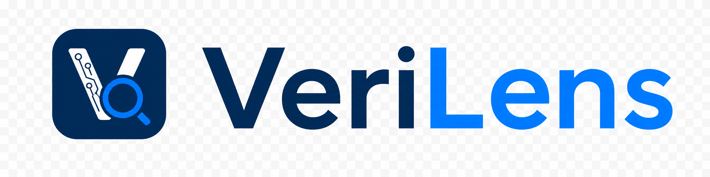

# VeriLens

**VeriLens** is an open-source hardware visualization tool that turns Verilog and SystemVerilog projects into interactive, explorable hardware diagrams.

Unlike simple static schematic generators, VeriLens is designed as a **project-aware hardware comprehension tool**. It analyzes an entire Verilog/SystemVerilog codebase, extracts structural hierarchy and connectivity, validates the design model, and renders zoomable diagrams that help users understand how modules, signals, and subsystems fit together.

The goal is not to replace a simulator, synthesizer, or full compiler. Instead, VeriLens focuses on making hardware projects easier to explore, debug, and explain.

## Architecture

VeriLens contains a lexer, parser, structural AST, validator, and interactive diagram frontend. It is a **structural extractor**, not a full compiler. The goal is to extract just enough information from Verilog/SystemVerilog to produce accurate, meaningful hardware diagrams.

```
Lexer → Parser → AST → Validator → Diagram Frontend
```

### What each stage does

**Lexer / Parser / AST**
The parser extracts the structural information needed for visualization and intentionally ignores language features that do not contribute to diagram generation. The AST acts as a structural model of the hardware project.

The extracted information includes:

- Module declarations, including names, ports, directions, and widths
- Module instantiations, including module names, instance names, and port connections
- Wire/reg declarations for tracing connections between instances
- Assign and always blocks represented as opaque logic nodes
- Generate blocks unrolled into parallel instantiation nodes

The AST is not intended to represent every semantic detail of Verilog/SystemVerilog. Instead, it captures the subset of the design that is useful for understanding hierarchy, connectivity, and structural organization.

`generate` blocks are elaborated into concrete structural nodes. Parameters must be resolved before elaboration, which is a reasonable constraint for a visualization-focused tool.

**Validator**
The validator performs lightweight semantic analysis over the structural AST. Its purpose is to ensure that the generated diagram is coherent and not misleading.

The validator checks:

- All instantiated modules are defined in the input project
- Port connection counts match the target module definition
- Connected signals have compatible widths
- Required ports do not have dangling connections
- Module references across files are resolved correctly

The validator builds a symbol table in a first pass:

```
module name → port list / module metadata
```

It then checks all instantiations against this symbol table. This is connectivity validation, not full language-level semantic analysis.

**Diagram Frontend**
The diagram frontend consumes the validated structural model and renders an interactive hardware diagram. The structural model maps naturally to a graph: modules become nodes, and port/signal connections become edges.

VeriLens is designed around interactive exploration rather than static diagram output. Users should be able to zoom in and out of the design, expand modules using controls such as a `+` button, collapse submodules, and navigate the hierarchy at different levels of detail.

The frontend should make large hardware designs easier to understand by supporting:

- Hierarchical zoom in / zoom out
- Expandable and collapsible modules
- Cross-file module navigation
- Signal tracing between instances
- Clean hardware-oriented layout, not just raw graph output
- Multiple views of the same design at different abstraction levels

## Multiple Abstraction Levels

VeriLens is intended to support multiple visualization modes, because a single diagram is rarely enough to understand a real hardware project.

Users should be able to switch between views such as:

- **Module hierarchy view** — shows the project-level hierarchy of modules and submodules
- **RTL block/dataflow view** — shows structural data movement between registers, combinational logic, memories, and module instances
- **FSM view** — shows detected or user-annotated finite state machines when possible
- **Signal fan-in / fan-out view** — allows users to trace where a signal comes from and where it is used
- **Clock/reset tree view** — highlights clock and reset distribution across the design
- **Netlist/gate-level view** — provides a lower-level structural view when the input or backend representation supports it

This multi-view approach is an important part of VeriLens. Existing tools often produce a single static schematic or hierarchy graph, while VeriLens aims to provide an interactive frontend for exploring a hardware project from several useful perspectives.

## Repository Structure

VeriLens is a monorepo. The C++ core and all JS/TS frontends live together with clear package boundaries.

```
verilens/
├── core/          # C++ — lexer, parser, AST, validator, JSON netlist output
├── packages/
│   ├── renderer/  # Shared diagram rendering — consumes JSON, used by all frontends
│   ├── extension/ # VSCode extension — calls core binary, renders in a Webview panel
│   ├── cli/       # Terminal tool — calls core binary, opens diagram in browser
│   └── web/       # Website — drag-and-drop Verilog upload, browser/server frontend
└── schemas/       # JSON schema defining the contract between core and renderer
```

The C++ core outputs a JSON structural netlist. This JSON format is the interface between the C++ analysis side and the JS/TS visualization side. Both sides can be developed independently as long as they agree on the schema.

`packages/renderer` is the shared rendering package used by all frontends. Diagram rendering logic is written once and reused across the VSCode extension, CLI, and website.

The VSCode extension and CLI invoke the compiled `core` binary through `child_process`. For the website, `core` can either be compiled to WebAssembly using Emscripten for a fully client-side experience, or called from a backend server for larger projects and heavier analysis.

## What makes VeriLens different

VeriLens is not trying to be the first tool that draws a diagram from Verilog. Instead, its goal is to provide a better developer experience for understanding real hardware projects.

Many existing approaches generate static schematics, raw Graphviz diagrams, or simple hierarchy views. VeriLens focuses on:

- Whole-project Verilog/SystemVerilog analysis
- Interactive diagram exploration
- Zoomable and expandable module hierarchy
- Multiple abstraction levels
- Cross-file structural understanding
- Connectivity-aware validation
- Shared rendering across VSCode, CLI, and web frontends

The main contribution is the combination of structural extraction, project-scale understanding, and an interactive frontend designed specifically for hardware comprehension.

## What VeriLens does not do

VeriLens is intentionally scoped to visualization and structural understanding. For other use cases we recommend:

- **Full linting and semantic analysis** — [Verible](https://github.com/chipsalliance/verible)
- **Simulation** — [Verilator](https://www.veripool.org/verilator/) or [Icarus Verilog](https://github.com/steveicarus/iverilog)
- **Synthesis** — [Yosys](https://github.com/YosysHQ/yosys)

VeriLens does not aim to replace these tools. Instead, it complements them by helping users understand the structure of their hardware projects visually.

## Project Goal

The long-term goal of VeriLens is to become an open-source visual exploration tool for Verilog/SystemVerilog projects.

A user should be able to open a hardware repository and quickly answer questions like:

- What is the top-level module?
- How are the major modules connected?
- Where does this signal go?
- What modules are inside this subsystem?
- Which logic belongs to this clock or reset domain?
- What does this design look like at a higher or lower abstraction level?

VeriLens aims to make hardware codebases easier to navigate, explain, and debug through interactive visualization.
